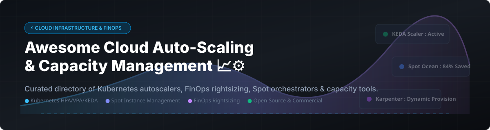

# Awesome-Cloud-Auto-Scaling-Capacity-Management

# Awesome-Cloud-Auto-Scaling-Capacity-Management 📈 ⚙️



  





  
  
  
  
  
  



---

## 🌟 Top Cloud Auto-Scaling & Capacity Management Ecosystem

**Curated List of Commercial Capacity Optimization Platforms & Open-Source Autoscaling Frameworks**  
*Focused on Kubernetes Autoscaling, VM Rightsizing, Spot Instance Orchestration, Event-Driven Scaling & Self-Hosted Capacity Management*

**Last updated: October 2026** 📅

---

### 📌 Overview & SEO Summary
Welcome to the ultimate curated directory of **cloud auto-scaling platforms**, **open-source capacity management frameworks**, and **Kubernetes resource optimization tools**. Whether you are looking for enterprise-grade commercial solutions (such as *Cast AI*, *Spot by NetApp/Flexera*, and *Turbonomic*), or self-hostable open-source alternatives (like *KEDA*, *Kubecost*, and *Limes*), this list covers category leaders, event-driven autoscalers, and privacy-respecting capacity optimization.

---

## 📑 Table of Contents
- [🏢 SaaS & Commercial Platforms](#-saas--commercial-platforms)
- [🔓 Open-Source GitHub Projects](#-open-source-github-projects)
- [🛠️ How to Contribute](#%EF%B8%8F-how-to-contribute)
- [📊 Star History](#-star-history)
- [🤝 Support & Sponsorship](#-support--sponsorship)
- [⚠️ Disclaimer](#%EF%B8%8F-disclaimer)

---

## 🏢 SaaS / Commercial Platforms

The cloud auto-scaling and capacity management market is split between **free native cloud tools** (AWS Auto Scaling) that charge only for underlying resources, and **specialized optimization platforms** that charge based on managed compute, savings achieved, or per-instance fees. **Cast AI** offers a permanently free monitoring tier with no cluster limits, with optimization starting at $1,000/month base plus $5/vCPU/month . **Spot by NetApp (Flexera)** provides a free tier covering up to 20 VMs, then bills $1.415 per 100 vCPU hours for managed compute plus savings-tracking dimensions at $0.001–$0.28 per unit . **IBM Turbonomic** starts at $18.75/month for cloud optimization or $225/year usage-based for datacenter, with pricing scaling as **2.5% of cloud spend** in some models . **StormForge** charges **$3 per month per vCPU** through AWS Marketplace with no upfront costs .

| SaaS / Commercial Platform | Company / Owner | Valuation / Market Cap | Standard Edition Starting Price | Free Tier / Free Trial Limits | Description |
| :--- | :--- | :--- | :--- | :--- | :--- |
| **[AWS Auto Scaling](https://aws.amazon.com/autoscaling/)** ☁️ | Amazon | ~$2.0 Trillion | **Free service**; pay only for underlying resources and CloudWatch  | **Free forever** (native service) | **AWS-native autoscaling** — Unified scaling for EC2, ECS, DynamoDB, Aurora, and Spot Fleet. Predictive scaling with machine learning. Target tracking, step scaling, and scheduled actions. |
| **[Cast AI](https://cast.ai/)** 🎯 | Cast AI | Private | **Growth: $1,000/month base + $5/vCPU/month**  | **Free (Monitoring): unlimited clusters, read-only recommendations, no automated changes**  | **Kubernetes automation and cost optimization** — Automated autoscaling, Spot instance management with interruption prediction, workload rightsizing at millicore level, bin packing, and pod scheduling optimization. |
| **[Spot by NetApp (Flexera)](https://spot.io/)** 🟢 | NetApp / Flexera | ~$20 Billion | **$1.415/100 vCPU hours** for managed compute (on-demand, reserved, and spot alike)  | **Free tier: up to 20 VMs**  | **Cloud automation and optimization** — Elastigroup and Ocean savings dimensions bill per unit at **$0.001, $0.15, and $0.28** — the fee tracks savings achieved, not flat licensing . |
| **[IBM Turbonomic](https://www.ibm.com/products/turbonomic)** ⚙️ | IBM | ~$200 Billion | **$18.75/month** (cloud optimization) or **$225/year** usage-based for datacenter  | **30-day free trial** with full access, no credit card  | **Application resource management (ARM)** — Public cloud optimization, Kubernetes optimization, and application/database resource optimization. **Percentage-of-spend model** scales fees with cloud costs . |
| **[StormForge](https://www.stormforge.io/)** 🌩️ | StormForge | Private | **$3/month per vCPU** (AWS Marketplace)  | **No upfront or minimum cost**; pay-as-you-go  | **Kubernetes resource optimization** — ML-driven workload rightsizing and performance tuning. Billing based on requested CPU cores per connected cluster. |
| **[Densify](https://www.densify.com/)** 📊 | Densify | Private | **Sales-led pricing**; no public per-unit price  | **No advertised free tier**; trial on request  | **Autonomous K8S and GPU resource optimization** — API-driven analysis for AWS, Azure, GCP, and Kubernetes. Provides container recommendations and rightsizing for GPU workloads . |
| **[Kubecost](https://www.kubecost.com/)** 💰 | Kubecost (IBM) | Private | **Enterprise: custom pricing**; EKS-optimized bundle free on Amazon EKS  | **Free Tier 3.0: unlimited clusters but $100K spend cap over 30 days**  | **Kubernetes cost monitoring and optimization** — Real-time cost allocation, savings recommendations, and multi-cluster visibility. EKS-optimized bundle integrates with AWS billing for accurate discounts and Savings Plans . |
| **[Granulate](https://granulate.io/)** ⚡ | Intel (Acquired) | ~$100 Billion (Intel) | Custom enterprise pricing | Demo available | **Autonomous workload optimization** — No code changes required. Continuous ML-driven CPU and memory tuning. Acquired by Intel to improve data center efficiency. |
| **[Akamas](https://www.akamas.io/)** 🎛️ | Akamas | Private | Custom enterprise pricing | Demo available | **AI-powered performance and capacity optimization** — Automates tuning of JVM, Kubernetes, and cloud infrastructure parameters. |
| **[Sedai](https://www.sedai.io/)** 🤖 | Sedai | Private | **$10–$20/instance/month** or shared-savings percentage  | **14–30 day free trial** with read-only cost telemetry  | **Autonomous cloud management** — SLO-backed CPU/RAM rightsizing, Kubernetes HPA/VPA tuning, and AWS Lambda serverless cost reductions. Performance-based pricing aligns cost with delivered value . |

---

## 🔓 Open-Source GitHub Projects

*Sorted by GitHub_Stars_Count (Descending)* 🌟

- **[KEDA](https://github.com/kedacore/keda)**   
  **Kubernetes-based Event Driven Autoscaling**, Apache-2.0 licensed. **CNCF graduated project** — allows fine-grained autoscaling including **scale-to-zero** for event-driven Kubernetes workloads . Serves as a Kubernetes Metrics Server and allows users to define autoscaling rules using a dedicated **Custom Resource Definition (CRD)**. No external dependencies, runs on both cloud and edge. Integrates natively with Horizontal Pod Autoscaler (HPA) . 🎯

- **[Kubecost (Open Source Core)](https://github.com/kubecost/cost-analyzer-helm-chart)**   
  **Kubernetes cost monitoring and optimization**, Apache-2.0 licensed. **Free tier provides unlimited clusters with $100K spend cap over 30 days** in v3.0 . **Amazon EKS-optimized bundle** is free with no spend cap and integrates with AWS billing APIs for accurate pricing including **Savings Plans, Reserved Instances, and enterprise discounts** . ETL feature aggregates metrics for namespace-level, pod-level, and deployment-level visibility . 💰

- **[Kubernetes Vertical Pod Autoscaler (VPA)](https://github.com/kubernetes/autoscaler/tree/master/vertical-pod-autoscaler)**   
  **Automatic CPU and memory rightsizing**, Apache-2.0 licensed. **Sets container resource requests and limits based on observed usage** — reduces over-provisioning and improves cluster utilization. Supports **Recommender mode** for read-only recommendations before enabling auto-updates. 📊

- **[Goldilocks](https://github.com/FairwindsOps/goldilocks)**   
  **VPA recommendations dashboard**, Apache-2.0 licensed. **Provides a web dashboard for viewing VPA recommendations across all namespaces**. Identifies workloads with **mismatched resource requests** and recommends optimal CPU/memory values. **The easiest way to start rightsizing Kubernetes workloads**. 🐻

- **[Limes](https://github.com/sapcc/limes)**   
  **OpenStack-compatible quota and usage tracking service**, open-source. **Originally designed for SAP's internal cloud** . Discovers capacity and usage for OpenStack resources, then **automatically distributes quota among projects in a dynamic and automated fashion**. Records quota changes in **CADF format** for audit compatibility. Exposes quota and usage data as **Prometheus metrics** for monitoring and alerting. Will be renamed to **Limitas** in future v2 API . 📈

- **[c3x](https://github.com/c3xdev/c3x)**   
  **Cloud cost estimation for Terraform, Terragrunt, and CloudFormation**, open-source. **Fully offline mode with no API key required** . Provides **optimization recommendations, budget guardrails, and what-if analysis**. Estimates monthly costs for AWS resources including RDS, EC2, NAT Gateway, and Load Balancers. **Enables shift-left capacity planning** by catching cost regressions before deployment . 🏗️

- **[Cluster Autoscaler](https://github.com/kubernetes/autoscaler/tree/master/cluster-autoscaler)**   
  **Kubernetes cluster scaling**, Apache-2.0 licensed. **Automatically adjusts the size of Kubernetes clusters** when pods fail to schedule due to insufficient resources or when nodes are underutilized. Works with AWS, Azure, GCP, and other cloud providers. **The foundational cluster autoscaler** for Kubernetes. ⚙️

- **[Horizontal Pod Autoscaler (HPA)](https://github.com/kubernetes/kubernetes/tree/master/pkg/controller/podautoscaler)**   
  **Kubernetes pod autoscaling**, Apache-2.0 licensed. **Built into Kubernetes core** — scales pod replicas based on CPU utilization, memory, or custom metrics. Integrates with KEDA for event-driven scaling and with VPA for resource rightsizing. 📊

- **[kube-downscaler](https://github.com/hjacobs/kube-downscaler)**   
  **Scale down Kubernetes resources during off-hours**, Apache-2.0 licensed. **Reduces costs by scaling down non-production workloads** during nights and weekends. Configurable time windows and exception annotations. **Simple, effective capacity management for dev/test environments**. 🌙

---

## 🛠️ How to Contribute

Contributions are welcome! Follow these steps to submit new cloud auto-scaling platforms or open-source capacity management software:

1. 🍴 **Fork** the repository.
2. 📝 **Add/edit** entries in `README.md` maintaining table/list structure and formatting.
3. 🔗 Include project title, official website/GitHub link, exact Stars_Count, license, and brief description.
4. 🚀 Submit a **Pull Request** with a descriptive summary of your changes.

---

## 📊 Star History



---

## 🤝 Support & Sponsorship

If you find this cloud auto-scaling and capacity management repository useful, please consider supporting the project:

- ⭐ **Star** this repository to increase visibility!
- 🔀 **Fork** and share with fellow SREs, platform engineers, and open-source advocates.
- ☕ **Sponsor & Buy Me a Coffee**: Support ongoing open-source curation via the [GitHub Sponsor Dashboard](https://github.com/sponsors/ishandutta2007).

---

## ⚠️ Disclaimer

- This is a **community-curated** list — not exhaustive and not an endorsement. ℹ️
- **Cast AI contracts auto-renew** with minimum commitments, and there are **at least 9 documented hidden costs** beyond list price including implementation and training . **Spot by NetApp (Flexera)** savings-optimization dimensions bill at **$0.001, $0.15, and $0.28 per unit** — the fee climbs as the tool succeeds, making monthly totals hard to forecast .
- **Densify pricing is sales-led** with no public per-unit price — an agent or automated buyer has no way to estimate cost before engaging sales . **IBM Turbonomic does not automatically purchase Reserved Instances or Savings Plans** — recommendations remain manual .
- **Kubecost Free Tier 3.0** limits total spend visibility to **$100K over 30 days**; the Amazon EKS-optimized bundle has **no spend cap** and is free .
- Open-source solutions (KEDA, Kubecost, VPA, Limes) provide self-hosted ownership and transparency, but enterprise-grade SLA guarantees, multi-cloud optimization at scale, and vendor support remain primarily commercial offerings. **Always model vCPU-hour volume and savings-tracking fees** before committing to consumption-based optimization platforms. 📈

---



  <b>Made with ❤️ for SREs, platform engineers, and open-source capacity management advocates.</b>

